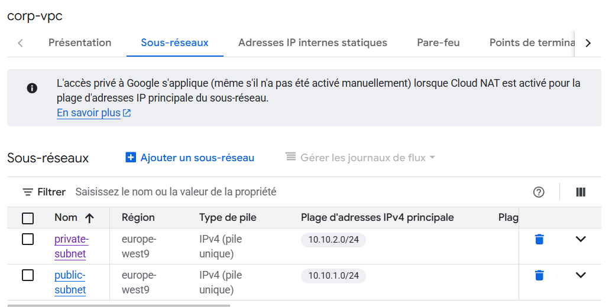
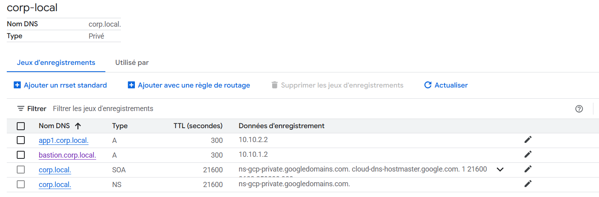

# TP 1 — Réseaux et Machines Virtuelles dans le Cloud

## Étape 1 — Création du réseau VPC et des sous-réseaux



---

## Étape 2 — Création des VM


---

## Étape 3 — Firewall


```
reguememartin@bastion:~$ ping 10.10.2.2
PING 10.10.2.2 (10.10.2.2) 56(84) bytes of data.
64 bytes from 10.10.2.2: icmp_seq=1 ttl=64 time=1.17 ms
64 bytes from 10.10.2.2: icmp_seq=2 ttl=64 time=0.288 ms
64 bytes from 10.10.2.2: icmp_seq=3 ttl=64 time=0.255 ms
^C
--- 10.10.2.2 ping statistics ---
3 packets transmitted, 3 received, 0% packet loss, time 2029ms
rtt min/avg/max/mdev = 0.255/0.570/1.167/0.422 ms


reguememartin@app1:~$ ping 10.10.1.2
PING 10.10.1.2 (10.10.1.2) 56(84) bytes of data.
64 bytes from 10.10.1.2: icmp_seq=1 ttl=64 time=1.08 ms
64 bytes from 10.10.1.2: icmp_seq=2 ttl=64 time=0.215 ms
64 bytes from 10.10.1.2: icmp_seq=3 ttl=64 time=0.213 ms
^C
--- 10.10.1.2 ping statistics ---
3 packets transmitted, 3 received, 0% packet loss, time 2008ms
rtt min/avg/max/mdev = 0.213/0.502/1.078/0.407 ms
```
---

##  Étape 4 — Authentification SSH
```
reguememartin@bastion:~/.ssh$ ls
google_compute_engine  google_compute_engine.pub 


reguememartin@app1:~/.ssh$ cat authorized_keys 
ssh-rsa AAAAB3NzaC1yc2EAAAADAQABAAABgQDEDeMLkuG95t3OKX0JZ5jPd3U57N1Ff1SUibKuK0G+GuHoexYCyr3B6XMERA7iXIGmWd3MEFf3+SEZfN8sHLhaYtFINLIc1BWk3IgiZC+eGPC0PCc6b+YxQKsXj8oZlIpFDoRyRj7wKnZEgEmVuEvhQHxojj9zU112Mq6+wFavIw5HIhQqY0szbeCSgANNeENtzfTKXMQvReFVqlJ8yj6MD+ALuVtrjCuZJNvY7B7XLF+wZVFh5qc4dV+bznh9qKft/8OxCrBJLtSXo9zhZusW4sGI0wGXRM3ieygo1KPT0dnZt+vpDyiIwbZH3uiquaUgRVvVe/iAHf0PwluvwvBqCyoqS2T0uMGZdm1ryaQLBg0rcQH4zTVCxEBkKMh2IW6kJ57OJVVyA3fZiUcr/5MJwV5xPilfk/T6xxni2QJZF3KjGiQ/zcAQYVq+PtOoijSs85prP2cYRcoooLKv9fQAdne/isVJN8k2ttrVxOMCk1eA8j9hEAM40N0FfvB2Aic= reguememartin@bastion
```
```
PS C:\Users\regue> ssh reguememartin@34.1.3.88
Linux bastion 6.1.0-40-cloud-amd64 #1 SMP PREEMPT_DYNAMIC Debian 6.1.153-1 (2025-09-20) x86_64

The programs included with the Debian GNU/Linux system are free software;
the exact distribution terms for each program are described in the
individual files in /usr/share/doc/*/copyright.

Debian GNU/Linux comes with ABSOLUTELY NO WARRANTY, to the extent
permitted by applicable law.
Last login: Mon Nov  3 13:05:11 2025 from 195.7.117.146
reguememartin@bastion:~$
```
```
reguememartin@bastion:~$ ssh reguememartin@10.10.2.2
Linux app1 6.1.0-40-cloud-amd64 #1 SMP PREEMPT_DYNAMIC Debian 6.1.153-1 (2025-09-20) x86_64

The programs included with the Debian GNU/Linux system are free software;
the exact distribution terms for each program are described in the
individual files in /usr/share/doc/*/copyright.

Debian GNU/Linux comes with ABSOLUTELY NO WARRANTY, to the extent
permitted by applicable law.
Last login: Mon Nov  3 13:19:21 2025 from 35.235.246.210
reguememartin@app1:~$ 
```
---

## Étape 5 — Cloud NAT

```
reguememartin@app1:~/.ssh$ ping  8.8.8.8
PING 8.8.8.8 (8.8.8.8) 56(84) bytes of data.
64 bytes from 8.8.8.8: icmp_seq=1 ttl=122 time=1.14 ms
64 bytes from 8.8.8.8: icmp_seq=2 ttl=122 time=0.806 ms
64 bytes from 8.8.8.8: icmp_seq=3 ttl=122 time=0.986 ms
--- 8.8.8.8 ping statistics ---
3 packets transmitted, 3 received, 0% packet loss, time 2019ms
rtt min/avg/max/mdev = 0.806/0.978/1.144/0.138 ms

reguememartin@app1:~/.ssh$ curl -I https://www.google.com
HTTP/2 200 
content-type: text/html; charset=ISO-8859-1
content-security-policy-report-only: object-src 'none';base-uri 'self';script-src 'nonce-H0tim2AquUEw8ZzVO6O2hA' 'strict-dynamic' 'report-sample' 'unsafe-eval' 'unsafe-inline' https: http:;report-uri https://csp.withgoogle.com/csp/gws/other-hp
accept-ch: Sec-CH-Prefers-Color-Scheme
p3p: CP="This is not a P3P policy! See g.co/p3phelp for more info."
date: Mon, 03 Nov 2025 13:29:21 GMT
server: gws
x-xss-protection: 0
x-frame-options: SAMEORIGIN
expires: Mon, 03 Nov 2025 13:29:21 GMT
cache-control: private
set-cookie: AEC=AaJma5tVjy7mfZWdsx9VA_yAMKcVO-1vaJSK_madXp-NVYWNT2SCXTRWKfY; expires=Sat, 02-May-2026 13:29:21 GMT; path=/; domain=.google.com; Secure; HttpOnly; SameSite=lax
set-cookie: __Secure-ENID=29.SE=a8ksciHlcAIr6lXki1u9IsCqzEhD7Jw4KjvmeusWau5Y03JeUlacpVnaHFFVWjei2bGQyPz2321j11YeCXKPEPFI5kKkIHxUh5MbOnfksjLDzhnqQ8MUGSgfrhUscYDpJJf8nvpkCXOqZ3elT_CcT-OZvhYd1eHzM9cE6IWhPcGakGEwNNzx-uuH9McMw-IBnv1V6_JFeAfGkF1kMtYYlFCvqFs4pBTVqdE7d1a3rz62AUIlyZtLJWQyHkUm; expires=Fri, 04-Dec-2026 05:47:39 GMT; path=/; domain=.google.com; Secure; HttpOnly; SameSite=lax

reguememartin@app1:~/.ssh$ sudo apt update 
Get:1 file:/etc/apt/mirrors/debian.list Mirrorlist [30 B]
Get:5 file:/etc/apt/mirrors/debian-security.list Mirrorlist [39 B]
Hit:2 https://deb.debian.org/debian bookworm InRelease      
Hit:7 https://packages.cloud.google.com/apt google-compute-engine-bookworm-stable InRelease
Hit:3 https://deb.debian.org/debian bookworm-updates InRelease
Hit:4 https://deb.debian.org/debian bookworm-backports InRelease
Hit:6 https://deb.debian.org/debian-security bookworm-security InRelease
Hit:8 https://packages.cloud.google.com/apt cloud-sdk-bookworm InRelease
Hit:9 https://packages.cloud.google.com/apt google-cloud-ops-agent-bookworm-2 InRelease
Reading package lists... Done
Building dependency tree... Done
Reading state information... Done
5 packages can be upgraded. Run 'apt list --upgradable' to see them.
```

---

## Étape 6 — DNS privé



```
reguememartin@bastion:~/.ssh$ nslookup bastion.corp.local
Server:         169.254.169.254
Address:        169.254.169.254#53

Non-authoritative answer:
Name:   bastion.corp.local
Address: 10.10.1.2

reguememartin@bastion:~/.ssh$ nslookup app1.corp.local
Server:         169.254.169.254
Address:        169.254.169.254#53

Non-authoritative answer:
Name:   app1.corp.local
Address: 10.10.2.2
```
---

## Étape 7 — VPN d’accès distant (OpenVPN installé sur la VM bastion)


```
PS C:\Users\regue> ping 10.10.1.2

Envoi d’une requête 'Ping'  10.10.1.2 avec 32 octets de données :
Réponse de 10.10.1.2 : octets=32 temps=96 ms TTL=64
Réponse de 10.10.1.2 : octets=32 temps=140 ms TTL=64
Réponse de 10.10.1.2 : octets=32 temps=43 ms TTL=64

PS C:\Users\regue> ping 10.10.2.2

Envoi d’une requête 'Ping'  10.10.2.2 avec 32 octets de données :
Réponse de 10.10.2.2 : octets=32 temps=121 ms TTL=63
Réponse de 10.10.2.2 : octets=32 temps=147 ms TTL=63
Réponse de 10.10.2.2 : octets=32 temps=131 ms TTL=63
Réponse de 10.10.2.2 : octets=32 temps=34 ms TTL=63

PS C:\Users\regue\.ssh> nslookup bastion.corp.local
Serveur :   169.254.169.254
Address:  169.254.169.254#53

Réponse ne faisant pas autorité :
Nom :    bastion.corp.local
Addresses: 10.10.1.2
```
### REGUEME Martin
---