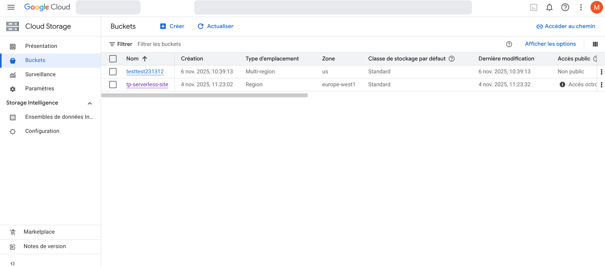
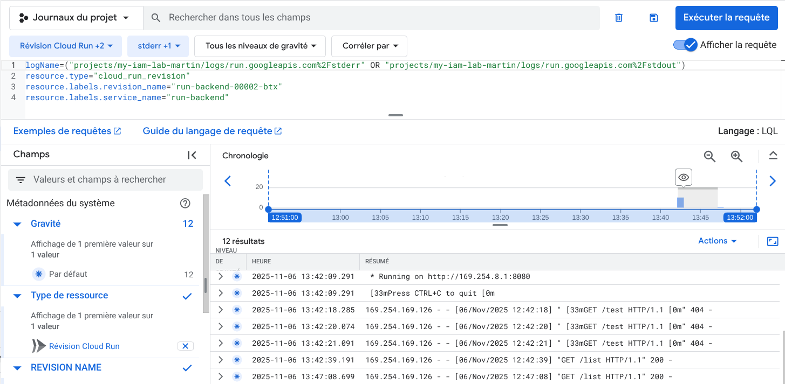

# TP — Maîtriser la gestion des identités et des rôles sur Google Cloud - Partie 1

## Exercice 1 — Créer les identités de base

1. Création du projet
Créez un nouveau projet GCP.
```
gcloud projects create my-iam-lab-martin --name="IAM-TP-Project"
Create in progress for [https://cloudresourcemanager.googleapis.com/v1/projects/my-iam-lab-martin].
Waiting for [operations/create_project.global.8341794069098517607] to finish...done.                                                                                                       
Enabling service [cloudapis.googleapis.com] on project [my-iam-lab-martin]...
Operation "operations/acat.p2-1081251897493-0751f673-ee67-47b9-abd5-7ca3990c9c7a" finished successfully.
```
```
gcloud projects list
PROJECT_ID                      NAME              PROJECT_NUMBER
bold-result-477110-b6           My First Project  513126423995
forum-379808                    Forum             941857430866
c              IAM-TP-Project    1081251897493
my-project-17685-1696414864649  My Project 17685  66751191449

```

```
gcloud config set project my-iam-lab-martin

Updated property [core/project].
```

2. Utilisateurs IAM
Ajoutez deux comptes utilisateur :
un utilisateur Lecteur - roles/viewer
un utilisateur Collaborateur - roles/editor
Ces utilisateurs représentent deux personnes fictives avec des rôles
différents.

```
gcloud projects add-iam-policy-binding $(gcloud config get-value project) \
                                       --member="user:orealyzgaming@gmail.com" \
                                       --role="roles/viewer"
Updated IAM policy for project [my-iam-lab-martin].
bindings:
- members:
  - user:reguememartin@gmail.com
  role: roles/owner
- members:
  - user:orealyzgaming@gmail.com
  role: roles/viewer
etag: BwZC6PMxgpA=
version: 1

```

```
gcloud projects add-iam-policy-binding $(gcloud config get-value project) \
                                       --member="user:menfougg@gmail.com" \
                                       --role="roles/editor"
Updated IAM policy for project [my-iam-lab-martin].
bindings:
- members:
  - user:menfougg@gmail.com
  role: roles/editor
- members:
  - user:reguememartin@gmail.com
  role: roles/owner
- members:
  - user:orealyzgaming@gmail.com
  role: roles/viewer
etag: BwZC6PXF0jY=
version: 1
```

3. Compte de service
Créez un compte de service appelé app-backend .
Ce compte de service représentera une application backend qui devra
accéder à certaines ressources.

```
gcloud iam service-accounts create app-backend \
                                       --display-name="App Backend Service Account"
Created service account [app-backend].
```
4. Vérification
Listez les comptes de service du projet.
Chaque compte de service possède une adresse e-mail de la forme :
app-backend@<PROJECT_ID>.iam.gserviceaccount.com .

```
gcloud iam service-accounts list

DISPLAY NAME                 EMAIL                                                  DISABLED
App Backend Service Account  app-backend@my-iam-lab-martin.iam.gserviceaccount.com  False

```

## Exercice 2 — Explorer IAM et les rôles

1. Lister les membres IAM
Affichez la policy IAM actuelle du projet et observez les bindings
existants.

```
gcloud projects get-iam-policy $(gcloud config get-value project) --format=json

{
  "bindings": [
    {
      "members": [
        "user:menfougg@gmail.com"
      ],
      "role": "roles/editor"
    },
    {
      "members": [
        "user:reguememartin@gmail.com"
      ],
      "role": "roles/owner"
    },
    {
      "members": [
        "user:orealyzgaming@gmail.com"
      ],
      "role": "roles/viewer"
    }
  ],
  "etag": "BwZC6PXF0jY=",
  "version": 1
}
```

## Exercice 3 — Portée des rôles et permissions atomiques

1. Comprendre les permissions d’un rôle
Cherchez dans la documentation ou via la CLI comment obtenir la
liste des permissions incluses dans un rôle prédéfini.
Utilisez cette méthode pour examiner le rôle roles/storage.objectViewer .

```
gcloud iam roles describe roles/storage.objectViewer

description: Grants access to view objects and their metadata, excluding ACLs. Can
  also list the objects in a bucket.
etag: AA==
includedPermissions:
- resourcemanager.projects.get
- resourcemanager.projects.list
- storage.folders.get
- storage.folders.list
- storage.managedFolders.get
- storage.managedFolders.list
- storage.objects.get
- storage.objects.list
name: roles/storage.objectViewer
stage: GA
title: Storage Object Viewer

```
Quelles permissions précises ce rôle contient-il ?

Il contient un rôle de Viewer 

2. Créer une ressource pour vos tests
Créez un bucket Cloud Storage dans votre projet.

```
cloud beta billing accounts list
ACCOUNT_ID            NAME                       OPEN  MASTER_ACCOUNT_ID
017D17-1FA4E0-79201D  Mon compte de facturation  True

```

```
gcloud beta billing projects link $(gcloud config get-value project) --billing-account=017D17-1FA4E0-79201D
billingAccountName: billingAccounts/017D17-1FA4E0-79201D
billingEnabled: true
name: projects/my-iam-lab-martin/billingInfo
projectId: my-iam-lab-martin

```

```
gcloud storage buckets create gs://iam-lab-bucket-martin --location=europe-west1

Creating gs://iam-lab-bucket-martin/...

```

3. Lister les permissions disponibles sur une ressource
Quelle commande permet d’afficher toutes les permissions
testables pour une ressource donnée ?
Appliquez-la au bucket Cloud Storage de votre projet pour observer
les permissions disponibles.

```
gcloud storage buckets get-iam-policy gs://iam-lab-bucket-martin
bindings:
- members:
  - projectEditor:my-iam-lab-martin
  - projectOwner:my-iam-lab-martin
  role: roles/storage.legacyBucketOwner
- members:
  - projectViewer:my-iam-lab-martin
  role: roles/storage.legacyBucketReader
etag: CAE=

```
Identifiez celles qui permettent la lecture des objets.

Celle qui permet la lecture est: roles/storage.legacyBucketReader


4. Accorder un rôle sur une ressource spécifique
Quelle commande permet d’attribuer un rôle IAM à un utilisateur ou
groupe uniquement sur une ressource (ici, le bucket) ?
Utilisez-la pour accorder le rôle Storage Object Viewer à votre
collaborateur sur ce bucket.
```
gcloud storage buckets add-iam-policy-binding gs://iam-lab-bucket-martin \
                                           --member="user:orealyzgaming@gmail.com" \
                                           --role="roles/storage.objectViewer"

bindings:
- members:
  - projectEditor:my-iam-lab-martin
  - projectOwner:my-iam-lab-martin
  role: roles/storage.legacyBucketOwner
- members:
  - projectViewer:my-iam-lab-martin
  role: roles/storage.legacyBucketReader
- members:
  - user:orealyzgaming@gmail.com
  role: roles/storage.objectViewer
etag: CAI=
kind: storage#policy
resourceId: projects/_/buckets/iam-lab-bucket-martin
version: 1

```
5. Tester l’accès restreint
Connectez-vous avec le compte collaborateur.
Essayez de :
lister les objets du bucket ;
télécharger un objet ;
accéder à un autre bucket du même projet.
Quelles opérations fonctionnent ? Lesquelles échouent ? Pourquoi ?
```
 gsutil iam get gs://iam-lab-bucket-martin

{
  "bindings": [
    {
      "members": [
        "projectEditor:my-iam-lab-martin",
        "projectOwner:my-iam-lab-martin"
      ],
      "role": "roles/storage.legacyBucketOwner"
    },
    {
      "members": [
        "projectViewer:my-iam-lab-martin"
      ],
      "role": "roles/storage.legacyBucketReader"
    },
    {
      "members": [
        "user:menfougg@gmail.com",
        "user:orealyzgaming@gmail.com"
      ],
      "role": "roles/storage.objectViewer"
    }
  ],
  "etag": "CAY="
}
```
```
gsutil cp test.txt gs://iam-lab-bucket-martin/
Copying file://test.txt [Content-Type=text/plain]...
/ [1 files][   10.0 B/   10.0 B]                                                
Operation completed over 1 objects/10.0 B.   
```

```
gsutil ls gs://iam-lab-bucket-martin
gs://iam-lab-bucket-martin/test.txt

```

```
gsutil cp gs://iam-lab-bucket-martin/test.txt ./downloaded_test.txt
Copying gs://iam-lab-bucket-martin/test.txt...
/ [1 files][   10.0 B/   10.0 B]                                                
Operation completed over 1 objects/10.0 B. 
```
on voit bien que je peux voir le bucket

6. Étendre le rôle au niveau projet
Quelle commande permet d’accorder un rôle à un utilisateur au
niveau projet cette fois ?
Appliquez-la pour attribuer le rôle Storage Object Viewer sur tout le
projet.
Testez de nouveau l’accès

```
gcloud projects add-iam-policy-binding $(gcloud config get-value project) \
                                       --member="user:orealyzgaming" \
                                       --role="roles/storage.objectViewer"

Updated IAM policy for project [my-iam-lab-martin].
bindings:
- members:
  - user:menfougg@gmail.com
  - user:menfougg@gmail.com
  role: roles/editor
- members:
  - user:reguememartin@gmail.com
  role: roles/owner
- members:
  - user:orealyzgaming@gmail.com
  role: roles/storage.objectViewer
- members:
  - user:orealyzgaming@gmail.com
  - user:orealyzgaming@gmail.com
  role: roles/viewer
etag: BwZC6dLypRg=
version: 1

```


7. Comparer les deux portées
Quelles différences observez-vous entre :
    un rôle appliqué sur une ressource spécifique ;
    un rôle appliqué sur un projet entier ?
Expliquez en une phrase ce que cela illustre du principe du moindre
privilège.

Niveau ressource → accès minimal.

Niveau projet → accès global.

```
gsutil ls gs://yayayayatest
gs://yayayayatest/README.md

```

8. Nettoyer la configuration
Quelle commande permet de retirer un rôle IAM accordé sur un
projet ?
Faites de même pour supprimer le rôle sur le bucket si nécessaire.
Vérifiez ensuite que le collaborateur n’a plus accès aux ressources.


```
gcloud projects remove-iam-policy-binding $(gcloud config get-value project) \
                                                                            --member="user:orealyzgaming@gmail.com" \
                                                                            --role="roles/storage.objectViewer"

Updated IAM policy for project [my-iam-lab-martin].
bindings:
- members:
  - user:menfougg@gmail.com
  - user:menfougg@gmail.com
  role: roles/editor
- members:
  - user:reguememartin@gmail.com
  role: roles/owner
- members:
  - user:orealyzgaming@gmail.com
  - user:orealyzgaming@gmail.com
  role: roles/viewer
etag: BwZC6hPXKuI=
version: 1
```

```
gcloud storage buckets remove-iam-policy-binding gs://iam-lab-bucket-martin \
                                           --member="user:orealyzgaming@gmail.com" \
                                           --role="roles/storage.objectViewer"
                                     
bindings:
- members:
  - projectEditor:my-iam-lab-martin
  - projectOwner:my-iam-lab-martin
  role: roles/storage.legacyBucketOwner
- members:
  - projectViewer:my-iam-lab-martin
  role: roles/storage.legacyBucketReader
- members:
  - user:menfougg@gmail.com
  role: roles/storage.objectViewer
etag: CAc=
kind: storage#policy
resourceId: projects/_/buckets/iam-lab-bucket-martin
version: 1

```


```
gsutil ls gs://iam-lab-bucket-martin

AccessDeniedException: 403 orealyzgaming@gmail.com does not have storage.objects.list access to the Google Cloud Storage bucket. Permission 'storage.objects.list' denied on resource (or it may not exist).
```
## Exercice 4 — Créer un rôle personnalisé pour Cloud Run

1. Identifier les permissions nécessaires
Consultez la documentation IAM de Cloud Run.
Quelles permissions sont nécessaires pour :
déployer un service Cloud Run ?
lister les services existants ?
supprimer un service ?
Notez les permissions correspondantes (elles commencent
généralement par run.services. ).

Permissions Cloud Run principales :

run.services.create

run.services.get

run.services.list

run.services.delete

2. Créer le fichier de définition
Créez un fichier YAML décrivant le rôle personnalisé.
Quelles sont les sections obligatoires de ce fichier ?
Ajoutez les permissions nécessaires pour permettre la création, la
lecture et la suppression de services Cloud Run.

[PermissionsFile](cloudrun_custom_role.yaml)

3. Créer le rôle dans votre projet
Quelle commande permet de créer un rôle IAM à partir d’un fichier
YAML ?
Utilisez-la pour créer le rôle personnalisé dans votre projet.
Où pouvez-vous vérifier sa présence après création ?
```
gcloud iam roles create cloudrunDeployer \
                                --project=$(gcloud config get-value project) \
                                --file=cloudrun_custom_role.yaml


Created role [cloudrunDeployer].
description: Rôle personnalisé pour gérer les services Cloud Run
etag: BwZC6jo9KfE=
includedPermissions:
- run.services.create
- run.services.delete
- run.services.get
- run.services.list
name: projects/my-iam-lab-martin/roles/cloudrunDeployer
stage: GA
title: CloudRun Deployer

```

```
gcloud iam roles list --project=$(gcloud config get-value project)

---
description: Rôle personnalisé pour gérer les services Cloud Run
etag: BwZC6jo9KfE=
name: projects/my-iam-lab-martin/roles/cloudrunDeployer
stage: GA
title: CloudRun Deployer
```
4. Attribuer le rôle à un utilisateur
Quelle commande permet d’accorder un rôle IAM à une identité sur
un projet ?
Utilisez votre second compte Gmail (collaborateur) comme
destinataire.
Pourquoi est-il important d’attribuer ce rôle à un autre compte que le
vôtre pour le tester ?

Mon propre compte dispose souvent de rôles d’administration (comme Owner, Editor ou Project Admin) qui lui donnent déjà toutes les permissions nécessaires.
Tester avec mon compte ne permet donc pas de vérifier si le rôle personnalisé donne bien uniquement les accès attendus.

```
gcloud projects add-iam-policy-binding $(gcloud config get-value project) \
                                --member="user:orealyzgaming@gmail.com" \
                                --role="projects/$(gcloud config get-value project)/roles/cloudrunDeployer"

Updated IAM policy for project [my-iam-lab-martin].
bindings:
- members:
  - user:orealyzgaming@gmail.com
  role: projects/my-iam-lab-martin/roles/cloudrunDeployer
- members:
  - serviceAccount:service-1081251897493@containerregistry.iam.gserviceaccount.com
  role: roles/containerregistry.ServiceAgent
- members:
  - serviceAccount:1081251897493-compute@developer.gserviceaccount.com
  - user:menfougg@gmail.com
  role: roles/editor
- members:
  - user:reguememartin@gmail.com
  role: roles/owner
- members:
  - serviceAccount:service-1081251897493@gcp-sa-pubsub.iam.gserviceaccount.com
  role: roles/pubsub.serviceAgent
- members:
  - serviceAccount:service-1081251897493@serverless-robot-prod.iam.gserviceaccount.com
  role: roles/run.serviceAgent
- members:
  - user:orealyzgaming@gmail.com
  - user:orealyzgaming@gmail.com
  role: roles/viewer
etag: BwZC6khLiP4=
version: 1

```
5. Tester le rôle
Connectez-vous sur le compte collaborateur.
Essayez d’effectuer les opérations suivantes :
déployer un service Cloud Run depuis une image conteneur,
lister les services existants,
supprimer un service.
Quelles actions réussissent ?
Quelles actions échouent ?
Que pouvez-vous en déduire sur les permissions incluses dans le
rôle ?

```
gcloud run deploy test-service \
                                --image=gcr.io/$(gcloud config get-value project)/my-app:latest \
                                --region=europe-west1 \
                                --platform=managed \
                                --no-allow-unauthenticated \
                                --service-account=collaborateur-sa@$(gcloud config get-value project).iam.gserviceaccount.com

Deploying container to Cloud Run service [test-service] in project [my-iam-lab-martin] region [europe-west1]
X Deploying new service...                                                                                                                                                                 
  . Creating Revision...                                                                                                                                                                   
  . Routing traffic...                                                                                                                                                                     
Deployment failed                                                                                                                                                                          
ERROR: (gcloud.run.deploy) [menfougg@gmail.com] does not have permission to access namespaces instance [my-iam-lab-martin] (or it may not exist): Permission 'iam.serviceaccounts.actAs' denied on service account collaborateur-sa@my-iam-lab-martin.iam.gserviceaccount.com (or it may not exist). This command is authenticated as menfougg@gmail.com which is the active account specified by the [core/account] property.

```
```
gcloud run services list --region=europe-west1

Listed 0 items.

```

Échoue, car la permission iam.serviceAccounts.actAs n’est pas incluse dans le rôle cloudrunDeployer.
On en déduit : le rôle permet de créer et gérer des services, mais pas d’utiliser un compte de service.


```
gcloud run services delete test-service --region=europe-west1 --quiet

Deleting [test-service]...failed.                                                                                                                                                          
ERROR: (gcloud.run.services.delete) Service [test-service] could not be found.

```
Échoue, car il n'a pas pus être créer avant étant donné que le compte n'avait pas les permissions

6. Analyser et corriger
Si certaines actions échouent, notez les permissions mentionnées
dans les messages d’erreur.
Ajoutez-les à votre fichier YAML si elles sont pertinentes.
Quelle commande permet de mettre à jour un rôle personnalisé avec
une nouvelle version du fichier ?
Appliquez la modification et refaites les tests.

```
gcloud run deploy test-service \
                                  --image=gcr.io/$(gcloud config get-value project)/my-app:latest \
                                  --region=europe-west1 \
                                  --platform=managed \
                                  --no-allow-unauthenticated

Deploying container to Cloud Run service [test-service] in project [my-iam-lab-martin] region [europe-west1]
X Deploying new service... Image 'gcr.io/my-iam-lab-martin/my-app:latest' not found.                                                                                                       
  X Creating Revision... Image 'gcr.io/my-iam-lab-martin/my-app:latest' not found.                                                                                                         
  . Routing traffic...                                                                                                                                                                     
Deployment failed                                                                                                                                                                          
ERROR: (gcloud.run.deploy) Image 'gcr.io/my-iam-lab-martin/my-app:latest' not found.

```
Maintenant ca fonctionne, je n'ai juste aps d'image dans ma registry don c'est normal

7. Nettoyer la configuration
Quelle commande permet de supprimer un rôle personnalisé du
projet ?
Dans quel cas est-il préférable de le retirer plutôt que de le
conserver ?

```
gcloud iam roles delete cloudrunDeployer --project=$(gcloud config get-value project)

deleted: true
description: Rôle personnalisé pour gérer les services Cloud Run
etag: BwZC6nzhtzI=
includedPermissions:
- artifactregistry.repositories.downloadArtifacts
- iam.serviceAccounts.actAs
- run.services.create
- run.services.delete
- run.services.get
- run.services.list
name: projects/my-iam-lab-martin/roles/cloudrunDeployer
stage: GA
title: CloudRun Deployer

```

Il est préférable de supprimer un rôle personnalisé si:
Il n’est plus utilisé : aucun utilisateur ou service n’en a besoin.
Il présente un risque de sécurité : par exemple, il contient trop de permissions ou des permissions sensibles qui pourraient être exploitées.
Tu veux nettoyer la configuration : éviter la confusion avec des rôles obsolètes ou inutiles dans ton projet.
Changement d’organisation : si tu migres vers une autre structure de gestion IAM et que ce rôle n’est plus pertinent.

## Exercice 5 — Gérer les comptes de service et les droits applicatifs

1. Attribuer le rôle approprié
L’application devra lire le contenu du bucket créé à l’exercice 4.
Quelle permission permet de lister et lire les objets d’un bucket
Cloud Storage ?
Quel rôle prédéfini contient ces permissions ?
Accordez ce rôle au compte de service run-backend uniquement sur
ce bucket.
Pourquoi faut-il éviter d’accorder ce rôle au niveau du projet ?

storage.objects.get → permet de télécharger ou lire un objet.
storage.objects.list → permet de lister les objets dans le bucket.

le rôle prédéfini est roles/storage.objectViewer
```
gcloud iam service-accounts list

DISPLAY NAME                     EMAIL                                                  DISABLED
App Backend Service Account      app-backend@my-iam-lab-martin.iam.gserviceaccount.com  False
Default compute service account  1081251897493-compute@developer.gserviceaccount.com    False
```
```
gsutil iam ch serviceAccount:app-backend@$(gcloud config get-value project).iam.gserviceaccount.com:objectViewer gs://iam-lab-bucket-martin
```


2. Préparer l’application à déployer
Créez une petite application web (Python, Node.js ou autre) qui :
TP — Maîtriser la gestion des identités et des rôles sur Google Cloud  Partie 1 11
expose une route HTTP (par exemple /list ) ;
liste le contenu du bucket Cloud Storage et renvoie la liste des
fichiers au format JSON.
Quelles bibliothèques client devez-vous installer pour interagir avec
Cloud Storage ?
Quelle variable d’environnement permettra de définir le nom du
bucket à interroger ?
Comment votre application s’authentifie-t-elle automatiquement
lorsqu’elle s’exécute sur Cloud Run ?


```
pip install flask google-cloud-storage

```
```
export BUCKET_NAME=iam-lab-bucket-martin
```

Si le service est lancé avec --service-account=app-backend@<PROJECT_ID>.iam.gserviceaccount.com, la bibliothèque google-cloud-storage utilisera automatiquement ce compte de service.
[main.py](main.py)
3. Conteneuriser l’application
Rédigez un Dockerfile minimal pour exécuter votre application.
Quelle instruction détermine le port utilisé par Cloud Run ?
Comment pouvez-vous tester localement votre conteneur avant
déploiement ?
Quelle commande permet de construire l’image et de la publier dans
le registre de conteneurs de votre projet ?

[Dockerfile](Dockerfile)
L’instruction ENV PORT=8080 permet à Cloud Run de connaître le port sur lequel l’application écoute.
Le conteneur doit écouter ce port (app.run(host="0.0.0.0", port=int(os.environ.get("PORT", 8080))) dans Flask par exemple).


```
docker build -t my-app .

```

```
docker run -p 8080:8080 \
  -e BUCKET_NAME=iam-lab-bucket-martin \
  -e GOOGLE_APPLICATION_CREDENTIALS="/tmp/key.json" \
  -v $PWD/key.json:/tmp/key.json:ro \
  my-app
```

```
curl http://localhost:8080/list

["test.txt"]

```

4. Déployer sur Cloud Run
Déployez le service sur Cloud Run en précisant :
le nom du service ;
la région de déploiement ;
le compte de service run-backend via l’option appropriée ;
l’image conteneur créée précédemment ;
Quelle option CLI permet de spécifier le compte de service associé
au déploiement ?

--service-account=SERVICE_ACCOUNT_EMAIL

Où pouvez-vous vérifier dans la console que Cloud Run utilise bien
ce compte de service ?

```
gcloud run services describe run-backend \
                                      --region=europe-west1 \
                                      --platform=managed \
                                      --format="value(spec.template.spec.serviceAccountName)"

app-backend@my-iam-lab-martin.iam.gserviceaccount.com

```

```
docker tag my-app gcr.io/$(gcloud config get-value project)/my-app:latest

```

```
docker push gcr.io/$(gcloud config get-value project)/my-app:latest

The push refers to repository [gcr.io/my-iam-lab-martin/my-app]
46258229b49c: Pushed 
d0b534a42c6e: Pushed 
838dca088102: Pushed 
928310af7ae8: Pushed 
3e79ec3d489e: Layer already exists 
cdd505bd8879: Layer already exists 
c28fab3840a6: Layer already exists 
36d06fe0cbc6: Layer already exists 
latest: digest: sha256:ac41ac13ee3c55559e578b80a5354ef91fc3f82dadb6e22b5378edc6de3a136d size: 1993

```

```
gcloud run deploy run-backend \
                                  --image=gcr.io/$(gcloud config get-value project)/my-app:latest \
                                  --region=europe-west1 \
                                  --platform=managed \
                                  --service-account=app-backend@$(gcloud config get-value project).iam.gserviceaccount.com \
                                 

Deploying container to Cloud Run service [run-backend] in project [my-iam-lab-martin] region [europe-west1]
✓ Deploying new service... Done.                                                                                                                                                           
  ✓ Creating Revision...                                                                                                                                                                   
  ✓ Routing traffic...                                                                                                                                                                     
Done.                                                                                                                                                                                      
Service [run-backend] revision [run-backend-00001-2vx] has been deployed and is serving 100 percent of traffic.
Service URL: https://run-backend-1081251897493.europe-west1.run.app

```


5. Tester le service
Accédez à l’URL du service Cloud Run.
Exécutez la route /list .
Le contenu du bucket s’affiche-t-il ?

```
gcloud run services describe run-backend \
                                      --region=europe-west1 \
                                      --platform=managed \
                                      --format="value(status.url)"

https://run-backend-5g4dz5fogq-ew.a.run.app

```

```
curl https://run-backend-5g4dz5fogq-ew.a.run.app/list

["test.txt"]

```
Que se passe-t-il si le service tente d’accéder à un autre bucket
pour lequel il n’a pas de rôle IAM ?

Si je modifie l’application pour lister un bucket différent, par exemple :

BUCKET_NAME = "unautre"

j'aurais une erreur 403:

google.api_core.exceptions.Forbidden: 403 GET https://storage.googleapis.com/storage/v1/b/autre-bucket: Permission 'storage.objects.list' denied


Comment ce comportement illustre-t-il le principe du moindre
privilège ?
Le service ne peut accéder qu’aux buckets pour lesquels il a un rôle IAM assigné (Storage Object Viewer).
Même si d’autres buckets existent dans le projet, le service ne peut pas les lire.
Ceci illustre le principe du moindre privilège : donner uniquement les permissions nécessaires pour accomplir la tâche, rien de plus.

6. Observer les logs
Rendez-vous dans Cloud Logging → Logs Explorer.
Recherchez les entrées correspondant à votre service Cloud Run et
aux requêtes Cloud Storage.


Quelle identité (principalEmail) apparaît dans les logs ?
Le compte de service qui a exécuté la requête.

Comment pouvez-vous confirmer que c’est bien le compte de
service run-backend qui a effectué la lecture du bucket ?

```
"protoPayload": {
  "authenticationInfo": {
    "principalEmail": "run-backend@my-iam-lab-martin.iam.gserviceaccount.com"
  }
}
```

7. Nettoyer la configuration
Supprimez le service Cloud Run si vous n’en avez plus besoin.

```
gcloud run services delete run-backend \
                                --region=europe-west1 \
                                --platform=managed

Service [run-backend] will be deleted.

Do you want to continue (Y/n)?  y

Deleting [run-backend]...done.                                                                                                                                                             
Deleted service [run-backend].

```

Pourquoi est-il risqué de laisser un compte de service inactif ou
surdimensionné en permissions dans un projet Cloud ?

un compte de service avec trop de permissions (par exemple roles/editor ou roles/owner) pourrait être utilisé pour accéder, modifier ou supprimer des ressources sensibles si ses identifiants sont exposés.
Principe du moindre privilège
Inactivité et gestion : un compte de service inactif mais encore autorisé peut être exploité par un acteur malveillant ou devenir un vecteur pour des attaques si ses clés sont compromises.
Audit et maintenance : plus il y a de comptes avec des permissions élevées, plus il devient difficile de gérer et d’auditer correctement les accès.