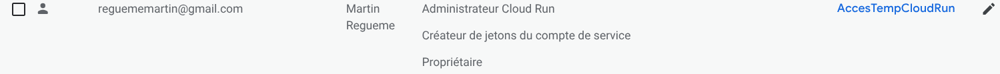
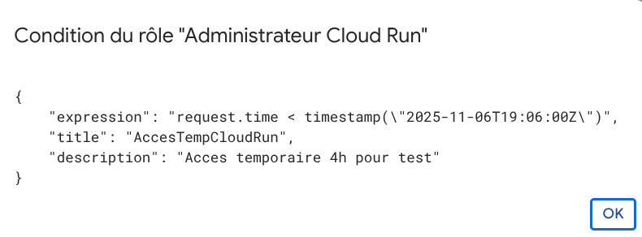

# TP — Maîtriser la gestion des identités et des rôles sur Google Cloud - Partie 2

## Exercice 6 — Délégation (Impersonation)


1. Créer un nouveau compte de service
Créez un compte de service nommé deploy-automation (ou équivalent).

```
gcloud iam service-accounts create deploy-automation \
                                      --display-name="Deploy Automation Service Account"

Created service account [deploy-automation].
```

2. Accorder la permission d’impersonation
Vous devez autoriser votre compte utilisateur personnel (Gmail) à
utiliser le compte de service deploy-automation .
Quel rôle IAM doit être accordé à votre utilisateur pour lui permettre
d’exécuter des actions en tant que ce compte ?
Le roles/iam.serviceAccountUser

Sur quelle ressource (le compte de service lui-même ou le projet)
cette permission doit-elle être appliquée ?
Sur le compte de service lui-même, pas sur le projet.
Cela limite la portée de la délégation uniquement à ce compte.
Pourquoi ne faut-il jamais donner ce rôle à tous les utilisateurs du
projet ?

Parce que cela permettrait à n’importe quel utilisateur d’endosser l’identité du compte de service, y compris pour exécuter des actions à privilèges élevés.

```
gcloud iam service-accounts add-iam-policy-binding app-backend@$(gcloud config get-value project).iam.gserviceaccount.com \
                                       --member="user:reguememartin@gmail.com" \
                                       --role="roles/iam.serviceAccountUser"

Updated IAM policy for serviceAccount [app-backend@my-iam-lab-martin.iam.gserviceaccount.com].
bindings:
- members:
  - user:reguememartin@gmail.com
  role: roles/iam.serviceAccountUser
etag: BwZC7UQxXnU=

```

3. Tester l’impersonation
Depuis Cloud Shell, exécutez une commande gcloud en endossant
l’identité du compte deploy-automation .
Quelle option CLI permet de spécifier le compte de service à utiliser
temporairement ?

L’option --impersonate-service-account

Exécutez une commande simple (par exemple lister les projets ou les
buckets) pour vérifier que l’impersonation fonctionne.
Quelles erreurs pouvez-vous rencontrer si la permission est
manquante ou mal configurée ?

Si les rôles Service Account User ou Token Creator sont manquants, ou si le compte de service n’a pas accès à la ressource ciblée, l’impersonation échoue et gcloud renvoie une erreur PERMISSION_DENIED.

```
gcloud projects add-iam-policy-binding my-iam-lab-martin \
                                       --member="user:reguememartin@gmail.com" \
                                       --role="roles/iam.serviceAccountTokenCreator"
```

```
gcloud projects list \
                                       --impersonate-service-account=app-backend@my-iam-lab-martin.iam.gserviceaccount.com
                                 
WARNING: This command is using service account impersonation. All API calls will be executed as [app-backend@my-iam-lab-martin.iam.gserviceaccount.com].
WARNING: This command is using service account impersonation. All API calls will be executed as [app-backend@my-iam-lab-martin.iam.gserviceaccount.com].
PROJECT_ID         NAME            PROJECT_NUMBER
my-iam-lab-martin  IAM-TP-Project  1081251897493


```
4. Utiliser l’impersonation avec Cloud Run
Dans quel cas pratique une impersonation peut-elle être utilisée lors
d’un déploiement Cloud Run ?
Lors d’un déploiement automatique depuis Cloud Build ou une CI/CD, tu peux permettre à un compte de build d’utiliser un compte de service dédié pour déployer sur Cloud Run, sans stocker de clé privée.

Quelles bonnes pratiques de sécurité s’appliquent à ce type de
délégation ?

N’accorder que le rôle roles/iam.serviceAccountUser à l’entité qui déploie.
Le compte de service impersonné doit avoir les rôles minimums nécessaires (roles/run.admin, roles/iam.serviceAccountUser sur les ressources concernées).
Activer les Audit Logs pour garder la traçabilité.

5. Observer dans les logs
Rendez-vous dans Cloud Logging → Logs Explorer.
Recherchez les journaux liés à votre action d’impersonation.
Quels champs du log indiquent :
le compte de service impersonné ;

"serviceData": {
  "policyDelta": {
    "bindingDeltas": [
      {
        "action": "ADD",
        "role": "roles/storage.admin",
        "member": "serviceAccount:app-backend@my-iam-lab-martin.iam.gserviceaccount.com"
      }
    ]
  }
}

le compte utilisateur délégant ?
oauthInfo: {1}
principalEmail: "reguememartin@gmail.com"
principalSubject: "user:reguememartin@gmail.com"

Comment ces informations assurent-elles la traçabilité et la nonrépudiation ?

L’association du compte humain et du compte impersonné dans les logs permet de suivre toutes les actions  et d’empêcher un utilisateur de nier avoir initié une action, même lorsqu’un compte de service est utilisé pour exécuter la commande.

6. Nettoyer la configuration
Retirez la permission d’impersonation accordée à votre utilisateur
personnel.
Pourquoi est-il important de révoquer ce type d’accès après usage ?

Moindre privilège
Les comptes de service peuvent avoir des droits élevés.
Garder un accès permanent pour impersoner un compte de service augmente inutilement la surface d’attaque.
Réduction du risque d’abus
Si un utilisateur malveillant ou compromis conserve la capacité d’impersoner un compte de service, il pourrait :
Exécuter des actions avec des privilèges élevés.
Accéder à des données sensibles.
Modifier des ressources critiques.

Quels risques apparaissent si un utilisateur garde la capacité
d’impersoner des comptes à privilèges ?

Escalade de privilèges : un utilisateur pourrait exécuter des actions normalement interdites.
Fuite de données sensibles via le compte de service.
Possibilité de déployer ou supprimer des ressources critiques sans contrôle.
Non‑respect des politiques de sécurité et d’audit internes, pouvant entraîner des sanctions ou incidents.

## Exercice 7 — Accès temporaire via IAM Conditions

1. Identifier le cas d’usage
Vous devez accorder un rôle d’administration limité dans le temps
sur votre projet.
Quel rôle IAM accorde des droits complets sur les services Cloud
Run ?

Le roles/run.admin permet de créer, mettre à jour, supprimer et gérer les services Cloud Run.

Quel rôle pourrait être utilisé pour une élévation temporaire de
privilège (ex. Compute Admin, Storage Admin, etc.) ?
Choisissez un rôle adapté à votre test.
Le roles/compute.admin pour Compute Engine, et le roles/storage.admin pour Storage, ou le roles/run.admin pour Cloud Run.

2. Définir la condition temporelle
Déterminez une date et heure d’expiration de l’accès (ex. 4 heures à
partir de maintenant).
Quelle syntaxe CEL permet d’exprimer cette limite temporelle ?

request.time < timestamp("2025-11-06T19:06:00Z")


3. Créer le rôle conditionnel
Quelle commande permet d’ajouter une attribution de rôle avec une
condition ?
Indiquez :
le membre ,
le rôle choisi,
l’expression CEL,
un titre et une description pour la condition.
Comment vérifier ensuite que le rôle est bien conditionnel dans la
console IAM ?

```
gcloud projects add-iam-policy-binding my-iam-lab-martin \
                                             --member="user:reguememartin@gmail.com" \
                                             --role="roles/run.admin" \
                                             --condition="title=AccesTempCloudRun,description='Acces temporaire 4h pour test',expression='request.time < timestamp(\"2025-11-06T19:06:00Z\")'"

```

4. Tester l’accès avant expiration
Immédiatement après l’attribution, testez une action autorisée par ce
rôle (ex. créer un service Cloud Run ou lire un bucket).
L’action doit être autorisée.
Où pouvez-vous vérifier dans la console IAM la présence de la
condition appliquée ?

```
gcloud run services list

   SERVICE       REGION        URL                                                      LAST DEPLOYED BY    LAST DEPLOYED AT
X  test-service  europe-west1  https://test-service-1081251897493.europe-west1.run.app  menfougg@gmail.com  2025-11-06T10:24:03.316281Z

```

5. Observer le comportement après expiration
Attendez que la date ou l’heure spécifiée soit dépassée.
Réessayez la même action.
Que se passe-t-il ?
Quelle erreur est renvoyée par la CLI ou la console ?
Comment ce comportement illustre-t-il le fonctionnement des
conditions IAM ?

ERROR: (gcloud.run.services.create) PERMISSION_DENIED: User reguememartin@gmail.com does not have permission to access project my-iam-lab-martin


6. Nettoyer la configuration
Supprimez le binding conditionnel ou modifiez la condition pour
supprimer la restriction temporelle.

```
gcloud projects remove-iam-policy-binding my-iam-lab-martin \
  --member="user:reguememartin@gmail.com" \
  --role="roles/run.admin"

```

# Exercice 8 — Auditer les accès et détecter les changements

1. Accéder aux logs
Ouvrez Cloud Logging → Logs Explorer.
Dans le filtre de recherche, indiquez le service cible.
Quelle est la différence entre les logs d’Admin Activity et ceux de
Data Access ?

Admin Activity : contient toutes les actions de configuration, modification de ressources, ou changements IAM.

Data Access : contient toutes les actions de lecture/écriture sur les données utilisateurs. Non activé par défaut, il faut l’activer explicitement.

Quelles catégories de logs sont activées par défaut sur votre projet ?
Admin Activity oui
System Event oui
Policy Denied oui
Data Access non suelement pour certains services

2. Observer les changements IAM
Filtrez sur les événements de type SetIamPolicy .

Que représentent ces événements ?
Ils indiquent qu’un rôle IAM a été ajouté, supprimé ou modifié sur une ressource (projet, compte de service, bucket, etc.).
Quelles informations pouvez-vous extraire de leur contenu ?
Qui a effectué la modification (principalEmail).
Quel rôle et quels membres ont été modifiés (policyDelta.bindingDeltas).
Quand l’action a eu lieu (timestamp).
Sur quelle ressource (resourceName).

Quelle ressource a été modifiée en dernier ?
resourceName
Comment confirmer que la modification provient bien de votre
utilisateur ?
protoPayload.authenticationInfo.principalEmail doit correspondre à mon users.

3. Analyser les accès Cloud Run
Filtrez les logs du service run.googleapis.com .
Recherchez des actions effectuées par le service Cloud Run associé
au compte run-backend .

Quelles opérations apparaissent ?
/Services.DeleteService
latestCreatedRevisionName, latestReadyRevisionName
Ready condition status changed to True.

Déploiement du conteneur avec spécification de ressources (CPU, mémoire), variables d’environnement et probes de démarrage (startupProbe).
Quelle valeur du champ principalEmail prouve que l’accès a été effectué
via le compte de service et non un utilisateur humain ?
Dans app-backend@my-iam-lab-martin.iam.gserviceaccount.com, on voit app-backend@my-iam-lab-martin.iam.gserviceaccount.com

Quelles permissions Cloud Run ou Storage ont été utilisées ?

Cloud Run :
Création, modification et suppression de services → run.services.create, run.services.update, run.services.delete.
Gestion des révisions → run.revisions.get, run.revisions.update.

Storage :
La variable d’environnement BUCKET_NAME=iam-lab-bucket-martin indique que le service pourrait accéder au bucket associé, ce qui nécessite les permissions :
storage.objects.get pour lire les objets.
storage.objects.create pour écrire des objets.

4. Exporter les logs
Quelle option de la console permet d’exporter les logs vers un
bucket ou BigQuery ?
Logs Explorer → “Créer un export” → choisir destination (bucket Cloud Storage, BigQuery, Pub/Sub).
Pourquoi est-il recommandé d’exporter les logs d’audit pour
conservation longue durée ?
Conservation à long terme, utile pour les audit,les analyses post-mortem et pour la conformité.
Quel format est utilisé lors de l’export JSON des logs (clé principale,
structure, champs importants) ?

Clé principale : protoPayload
Champs importants : principalEmail, resourceName, methodName, timestamp, status

5. Créer une alerte
Quelle méthode permet de créer une alerte basée sur un log dans
Cloud Monitoring ?
Cloud Monitoring → Alertes → Create policy basée sur les logs.
Filtrez par exemple sur protoPayload.methodName="SetIamPolicy" .
Quel événement déclencherait cette alerte ?
Toute modification IAM sur le projet ou compte de service.
Quelle notification pouvez-vous configurer ?
Email, SMS, Slack et Webhook
6. Nettoyer et consigner vos observations
Supprimez ou désactivez les filtres créés si vous ne souhaitez plus
suivre ces événements.
Enregistrez un exemple de log d’audit (au format JSON) montrant :

```json
{
  "protoPayload": {
    "@type": "type.googleapis.com/google.cloud.audit.AuditLog",
    "status": {},
    "authenticationInfo": {
      "principalEmail": "reguememartin@gmail.com",
      "principalSubject": "user:reguememartin@gmail.com",
      "oauthInfo": {
        "oauthClientId": "32555940559.apps.googleusercontent.com"
      }
    },
    "requestMetadata": {
      "callerIp": "195.7.117.146",
      "callerSuppliedUserAgent": "google-cloud-sdk gcloud/494.0.0 command/gcloud.iam.service-accounts.add-iam-policy-binding invocation-id/1991be2023f84904bfc413898ff06501 environment/None environment-version/None client-os/LINUX client-os-ver/6.17.6 client-pltf-arch/x86_64 interactive/True from-script/False python/3.11.9 term/xterm-256color (Linux 6.17.6-200.fc42.x86_64),gzip(gfe)",
      "requestAttributes": {
        "time": "2025-11-06T13:44:39.059671482Z",
        "auth": {}
      },
      "destinationAttributes": {}
    },
    "serviceName": "iam.googleapis.com",
    "methodName": "google.iam.admin.v1.SetIAMPolicy",
    "authorizationInfo": [
      {
        "resource": "projects/-/serviceAccounts/118074916540815430966",
        "permission": "iam.serviceAccounts.setIamPolicy",
        "granted": true,
        "resourceAttributes": {
          "name": "projects/-/serviceAccounts/118074916540815430966"
        },
        "permissionType": "ADMIN_WRITE"
      }
    ],
    "resourceName": "projects/-/serviceAccounts/118074916540815430966",
    "serviceData": {
      "@type": "type.googleapis.com/google.iam.v1.logging.AuditData",
      "policyDelta": {
        "bindingDeltas": [
          {
            "action": "ADD",
            "role": "roles/iam.serviceAccountUser",
            "member": "user:reguememartin@gmail.com"
          }
        ]
      }
    },
    "request": {
      "@type": "type.googleapis.com/google.iam.v1.SetIamPolicyRequest",
      "resource": "projects/my-iam-lab-martin/serviceAccounts/app-backend@my-iam-lab-martin.iam.gserviceaccount.com",
      "policy": {
        "bindings": [
          {
            "members": [
              "user:reguememartin@gmail.com"
            ],
            "role": "roles/iam.serviceAccountUser"
          }
        ],
        "version": 3,
        "etag": "ACAB"
      }
    },
    "response": {
      "bindings": [
        {
          "role": "roles/iam.serviceAccountUser",
          "members": [
            "user:reguememartin@gmail.com"
          ]
        }
      ],
      "@type": "type.googleapis.com/google.iam.v1.Policy",
      "etag": "BwZC7UQxXnU=",
      "version": 1
    }
  },
  "insertId": "17w6cjpe46sqs",
  "resource": {
    "type": "service_account",
    "labels": {
      "project_id": "my-iam-lab-martin",
      "unique_id": "118074916540815430966",
      "email_id": "app-backend@my-iam-lab-martin.iam.gserviceaccount.com"
    }
  },
  "timestamp": "2025-11-06T13:44:38.692514150Z",
  "severity": "NOTICE",
  "logName": "projects/my-iam-lab-martin/logs/cloudaudit.googleapis.com%2Factivity",
  "receiveTimestamp": "2025-11-06T13:44:40.146219271Z"
}
```