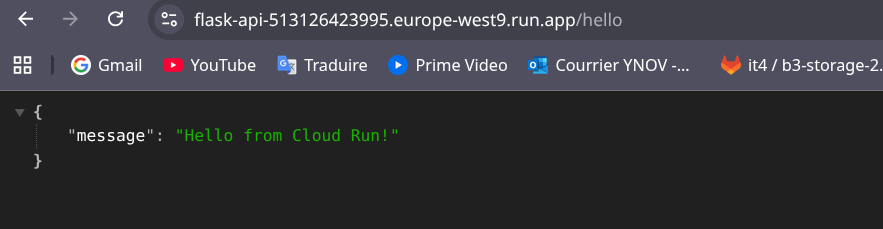
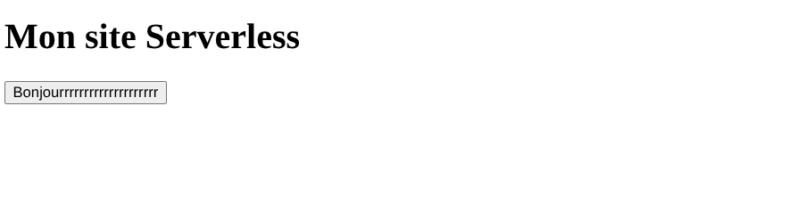
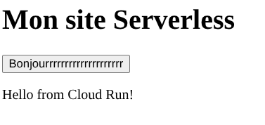
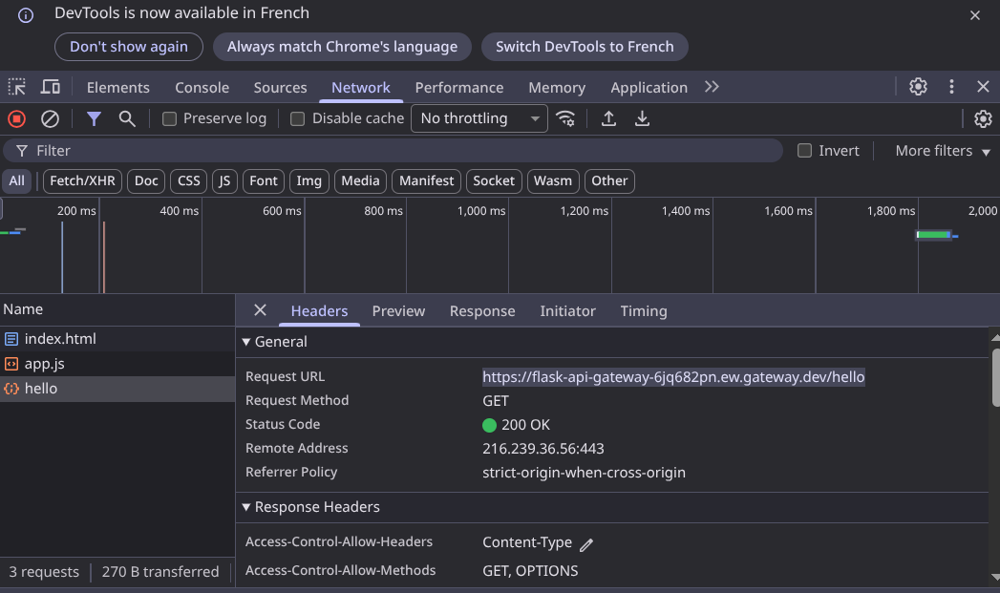
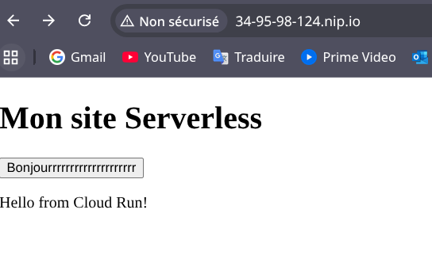

# Étape 1 — Déploiement de l’API REST en mode serverless
1. Créer une API Flask minimale
[API Flask ](main.py)

2. Préparer un conteneur de l’application
```
docker build -t flask-api .

gcloud services enable artifactregistry.googleapis.com run.googleapis.com

Operation "operations/acf.p2-513126423995-f7792c3d-a970-46d4-9f6a-f6b02738211d" finished successfully.

gcloud auth configure-docker europe-west9-docker.pkg.dev

Adding credentials for: europe-west9-docker.pkg.dev
After update, the following will be written to your Docker config file located at [/home/rmartin/.docker/config.json]:
 {
  "credHelpers": {
    "europe-west9-docker.pkg.dev": "gcloud"
  }
}

Do you want to continue (Y/n)?  y

Docker configuration file updated.

```
3. Publier l’image sur un registre de conteneurs

```
gcloud artifacts repositories create flask-api-repo \
                                                --repository-format=docker \
                                                --location=europe-west9 \
                                                --description="Repo pour mon API Flask"

Create request issued for: [flask-api-repo]
Waiting for operation [projects/bold-result-477110-b6/locations/europe-west9/operations/8bf35135-59c0-401f-93e9-8b62fdd5e3d4] to complete...done.                                          
Created repository [flask-api-repo].
 ~/D/M/I/tp-serverless   main ±  docker tag flask-api europe-west9-docker.pkg.dev/bold-result-477110-b6/flask-api-repo/flask-api:v1
                                    docker push europe-west9-docker.pkg.dev/bold-result-477110-b6/flask-api-repo/flask-api:v1

The push refers to repository [europe-west9-docker.pkg.dev/bold-result-477110-b6/flask-api-repo/flask-api]
a772422fffe9: Pushed 
a1693f517b29: Pushed 
26700785e55f: Pushed 
ebcaad93f639: Pushed 
7770fbb416af: Pushed 
acbbee3380a1: Pushed 
16dffb6a6636: Pushed 
d7c97cb6f1fe: Pushed 
v1: digest: sha256:a7af5e30c9dc8bb3431cb2152b0c9b516ecbf46a50dc778701784044d47b5180 size: 1990


gcloud run deploy flask-api \
                                            --image=europe-west9-docker.pkg.dev/bold-result-477110-b6/flask-api-repo/flask-api:v1 \
                                            --platform=managed \
                                            --region=europe-west9 \
                                            --allow-unauthenticated

Deploying container to Cloud Run service [flask-api] in project [bold-result-477110-b6] region [europe-west9]
✓ Deploying new service... Done.                                                                                                                                                           
  ✓ Creating Revision...                                                                                                                                                                   
  ✓ Routing traffic...                                                                                                                                                                     
  ✓ Setting IAM Policy...                                                                                                                                                                  
Done.                                                                                                                                                                                      
Service [flask-api] revision [flask-api-00001-tcj] has been deployed and is serving 100 percent of traffic.
Service URL: https://flask-api-513126423995.europe-west9.run.app

```
4. Vérifier le fonctionnement

https://flask-api-513126423995.europe-west9.run.app/hello



# Étape 2 — Exposer l’API via une passerelle publique
1. Définir l’interface de l’API
Créer le fichier api.yaml

[API.yaml](api.yaml)

Créer l’API Gateway:
```
gcloud api-gateway apis create flask-api-gateway

API [apigateway.googleapis.com] not enabled on project [bold-result-477110-b6]. Would you like to enable and retry (this will take a few minutes)? (y/N)?  y

Enabling service [apigateway.googleapis.com] on project [bold-result-477110-b6]...
Operation "operations/acat.p2-513126423995-0815c611-dca8-44d2-bd9d-5ddbe7674bd4" finished successfully.
Waiting for API [flask-api-gateway] to be created...done.  
```


2. Créer la passerelle et lier le backend

```
gcloud api-gateway api-configs create flask-api-config-v2 \
                                                --api=flask-api-gateway \
                                                --openapi-spec=api.yaml \
                                                --project=bold-result-477110-b6

Waiting for API Config [flask-api-config-v2] to be created for API [flask-api-gateway]...done.                                                                                               
```

3. Configurer l’accès public
```
 gcloud api-gateway gateways create flask-api-gateway \
                                            --api=flask-api-gateway \
                                            --api-config=flask-api-config-v2 \
                                            --location=europe-west1

Waiting for API Gateway [flask-api-gateway] to be created with [projects/bold-result-477110-b6/locations/global/apis/flask-api-gateway/configs/flask-api-config-v2] config...done. 
      
gcloud api-gateway gateways describe flask-api-gateway \
                                                                                    --location=europe-west1 \
                                                                                    --format="value(defaultHostname)"

flask-api-gateway-6jq682pn.ew.gateway.dev


```
4. Tester l’URL de la passerelle

```
curl https://flask-api-gateway-6jq682pn.ew.gateway.dev/hello
{"message":"Hello from Cloud Run!"}
```


# Étape 3 — Héberger un site web statique simple sur un service de stockage
1. Créer un petit site composé d’un fichier index.html et d’un fichier JavaScript
séparé.
[index.html](index.html)
[app.js](app.js)


1. Créer un service de stockage configuré pour l’hébergement statique :
```
gsutil mb -l europe-west1 gs://tp-serverless-site
gsutil web set -m index.html gs://tp-serverless-site
```
2. Téléverser les fichiers du site :
```
gsutil cp index.html app.js gs://tp-serverless-site
gsutil iam ch allUsers:objectViewer gs://tp-serverless-site
```
3. Tester l’affichage et l’appel à l’API :
```
curl http://tp-serverless-site.storage.googleapis.com/index.html
<!DOCTYPE html>
<html>
<head>
    <title>TP Serverless</title>
</head>
<body>
    <h1>Mon site Serverless</h1>
    <button id="helloBtn">Bonjourrrrrrrrrrrrrrrrrrrr</button>
    <p id="response"></p>
    <script src="app.js"></script>
</body>
</html>

```

Avant de cliquer sur le bouton


Après avoir cliqué sur le bouton


Network:



# Étape 4 — Distribuer le site via un CDN

1. Créer le backend pour le site statique (bucket GCS + CDN)
```
gcloud compute backend-buckets create tp-serverless-backend \
    --gcs-bucket-name=tp-serverless-site \
    --enable-cdn
```

2. Créer un Network Endpoint Group (NEG) pour l’API Cloud Run
```

gcloud compute network-endpoint-groups create api-neg \
    --region=europe-west1 \
    --network-endpoint-type=serverless \
    --cloud-run-service=flask-api \
    --cloud-run-tag=latest
```

3. Créer le backend service pour l’API
```

gcloud compute backend-services create api-backend \
    --global \
    --protocol=HTTP
```


Ajouter le NEG de l’API au backend service :

```
gcloud compute backend-services add-backend api-backend \
    --global \
    --network-endpoint-group=api-neg \
    --network-endpoint-group-region=europe-west1
```

Configurer l’en-tête Host pour rediriger vers ton Cloud Run / API Gateway :

```
gcloud compute backend-services update api-backend \
    --global \
    --custom-request-header="Host: flask-api-gateway-6jq682pn.ew.gateway.dev"
```

4. Configurer le Load Balancer (URL Map)

Modifier le url-map pour router /hello vers le backend API et le reste vers le bucket :
```
gcloud compute url-maps edit lb-serverless-map --global


Contenu du fichier édité :

defaultService: https://www.googleapis.com/compute/v1/projects/bold-result-477110-b6/global/backendBuckets/tp-serverless-backend
hostRules:
- hosts:
  - '*'
  pathMatcher: api-matcher
pathMatchers:
- name: api-matcher
  defaultService: https://www.googleapis.com/compute/v1/projects/bold-result-477110-b6/global/backendBuckets/tp-serverless-backend
  pathRules:
  - paths:
    - /hello
    service: https://www.googleapis.com/compute/v1/projects/bold-result-477110-b6/global/backendServices/api-backend
```

5. Vérifier le Load Balancer

Récupérer l’IP du LB et tester :
```
LB_IP=$(gcloud compute forwarding-rules list --filter="name=lb-serverless-http-rule" --format="value(IP_ADDRESS)")
DOMAIN="$LB_IP.nip.io"
```

# Tester le site
```
curl -H "Host: $DOMAIN" http://$LB_IP/
<!DOCTYPE html>
<html>
<head>
    <title>TP Serverless</title>
</head>
<body>
    <h1>Mon site Serverless</h1>
    <button id="helloBtn">Bonjourrrrrrrrrrrrrrrrrrrr</button>
    <p id="response"></p>
    <script src="app.js"></script>
</body>
</html>

```


# Tester l'API

```
curl -H "Host: $DOMAIN" http://$LB_IP/hello
{"message":"Hello from Cloud Run!"}
```

HTTPS:

```
gcloud compute ssl-certificates create lb-serverless-ssl \
    --domains="$LB_IP.nip.io" \
    --global \
    --description="Certificat SSL géré pour TP Serverless"
Created [https://www.googleapis.com/compute/v1/projects/bold-result-477110-b6/global/sslCertificates/lb-serverless-ssl].
NAME               TYPE     CREATION_TIMESTAMP             EXPIRE_TIME  REGION  MANAGED_STATUS
lb-serverless-ssl  MANAGED  2025-11-04T06:27:35.505-08:00                       PROVISIONING
    34.95.98.124.nip.io: PROVISIONING

```
```
gcloud compute target-https-proxies create lb-serverless-https-proxy \
    --url-map=lb-serverless-map \
    --ssl-certificates=lb-serverless-ssl

```

```
gcloud compute forwarding-rules create lb-serverless-https-rule \
    --global \
    --target-https-proxy=lb-serverless-https-proxy \
    --ports=443 \
    --address=$LB_IP
```
